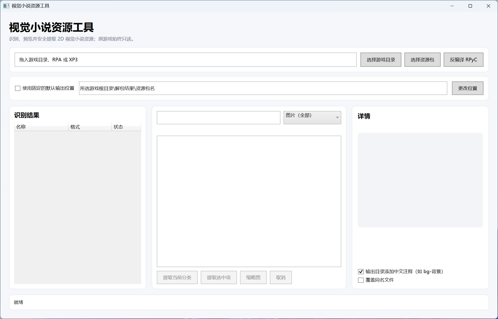
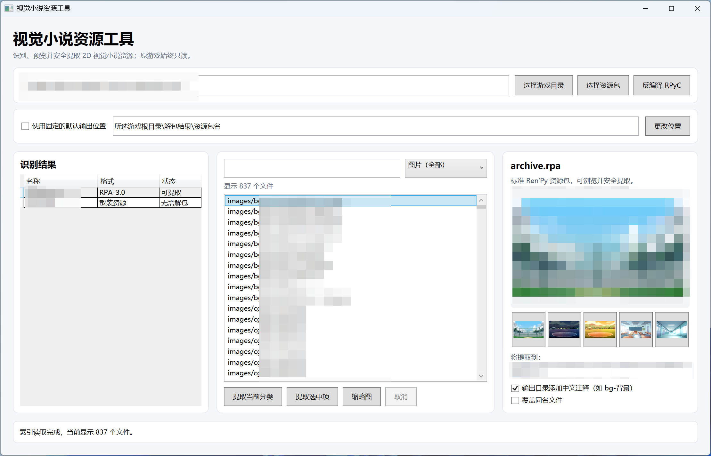

# Visual Novel Resource Tool

[中文](README.md) | [English](README_EN.md)

A beginner-friendly Windows GUI for detecting, previewing, classifying, and
safely extracting visual-novel resources. Source game files are always opened
read-only and output is written to a separate directory.

> Only process resources you are authorized to access. Extraction does not
> grant permission to redistribute or commercially reuse game assets. See the
> [legal and copyright notice](DISCLAIMER.md).

## Interface preview

Drop a complete game directory, RPA, or XP3 onto the window, or use the
selection buttons on the right.



After detection, filter the resources, inspect the main preview and five nearby
thumbnails, then extract by category, selection, or drag and drop.



## Highlights

- Scan a complete game directory or an individual archive.
- Browse and extract Ren'Py RPA 2.0, 3.0, and 3.2 without unsafe `pickle.loads`.
- Browse and extract standard KiriKiri XP3 archives.
- Restore encrypted RPG Maker MV/MZ images and audio using the project key.
- Browse AES-encrypted RPG Maker MV `data.pak` packages with embedded `packageKey`.
- Browse DPMX containers and supported Enigma Virtual Box packaged executables.
- Detect loose images and videos even when a small archive is also present.
- Default visual-only view with CG, background, character, animation/video,
  UI, and other-image categories.
- Search, multi-select extraction, thumbnail grid, five nearby previews, GIF
  playback, and lightweight WebM/MP4 preview.
- Drag selected files directly to Explorer or the desktop.
- Optional Chinese labels for common output folders.
- Safe path handling, Windows filename sanitization, per-file failure isolation,
  progress reporting, and cancellation.
- Integrated unrpyc 2.x workflow for `.rpyc` decompilation.

## Requirements

- Windows x64.
- Published releases are self-contained and do not require a separate .NET runtime.
- Video preview optionally uses `ffmpeg.exe` from `PATH`. Extraction still works
  when FFmpeg is unavailable.

## Build

```powershell
$env:DOTNET_CLI_HOME = "$PWD\.dotnet-home"
dotnet build VisualNovelResourceTool.sln -c Release
dotnet run --project VisualNovelResourceTool.Tests -c Release
pwsh -NoProfile -File scripts/Publish-Portable.ps1
```

The maintained application folder is named `视觉小说资源工具` beside the source
directory. Use and share this same folder, including `third_party`. Personal
settings stay under `%LOCALAPPDATA%\视觉小说资源工具`. Archives are generated on
demand with `scripts/Compress-Portable.ps1`; no separate sharing build is kept.

## Output rules

When a complete game directory is selected, output defaults to
`<game root>\解包结果\<archive name>`. A fixed output root can be configured in
the UI. Existing files are not overwritten unless explicitly enabled.

## Scope and limitations

Not every visual novel can be extracted. Proprietary encryption, game-specific
filters, layered character composition, unsupported codecs, and custom engine
formats may require dedicated handlers. The project favors clear diagnostics
over guessing or silently producing corrupt output.

GARbro supports many more legacy and game-specific formats. This project does
not embed GARbro as a second application; compatible MIT-licensed format
handlers may be ported selectively into the unified .NET 8 architecture with
proper attribution.

## Licenses

This project is licensed under the [MIT License](LICENSE). See
[THIRD_PARTY_NOTICES.md](THIRD_PARTY_NOTICES.md) for bundled dependencies.
